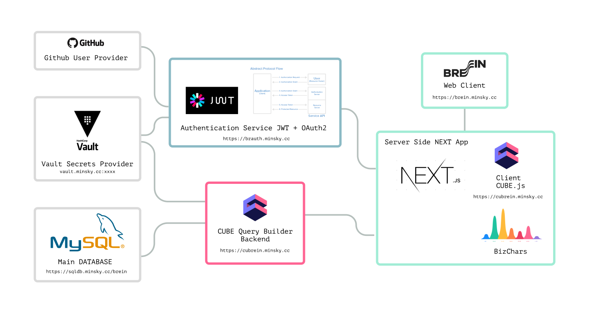

# BREIN Project

This projects was created with the extendible paradigm in mind. The porpuse of that is shows how to create simple analytics platform with open source and scalable tools. The demo has up to 6 services running to make a complete resilient system*. Components of the system are:

- **MySQL Database** as principal repository**
- **Vault Instance** as a Global secret manager
- **JWT / OAuth2** as Authenticator engine
- **CUBE Server** as Query builder for SQL Database
- **NEXT Server** as Web SSR framework
- **BizCharts** as Dynamic charts framework

Each folder in this repository saves one service related to the above components

- **brein**: saves all the frontend project (makes with nextjs)

- **brauth**: saves all the code for the JWT/OAuth2 authoring service

- **cubrein**: saves the CUBE Backend configuration and scheme description of all entities in the DB.

- **datasettools**: saves tools used to convert the initial csv files into sql (mysql flavor) compatible files.

  [docker-compose](./docker-compose.yaml) saves the composer to deploy all services

  

\* In normal conditions this projects needs to be executed into different repositories (isolated environments) and orchestrated with a container orchestrator (e.g. Kubernetes, Docker Swarm), but for the demo this is in a mono repo environment and managed by docker compose.

** See the [Database README](./datasettools) for more information.

### Architecture Graphic

  

