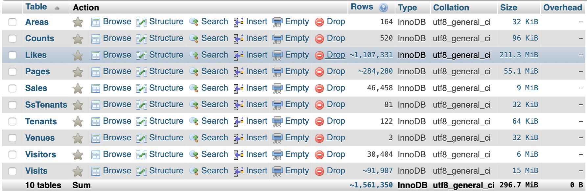

# About Datasets

I wrote these programs to convert the raw csv datasets given by BREIN into \*mysql tables.
In order to complete that task I create a pandas based script (see [metamorph.v2.py](./metamorph.v2.py)).

`*I choose MySQL because I've a mysql server ready to use, also MySQL has more functions than other SQL flavors. And finally, a lot of analytic related frameworks has drivers for this sqlengine`

## Results

  

